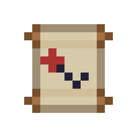
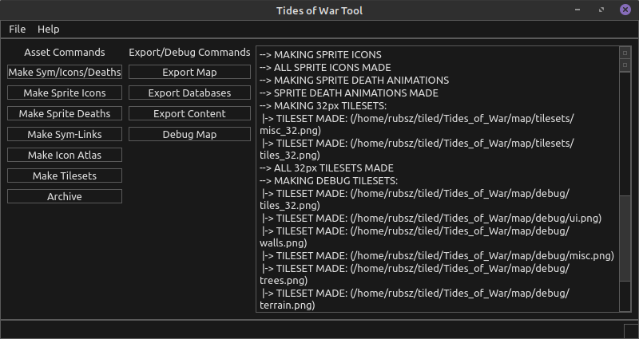
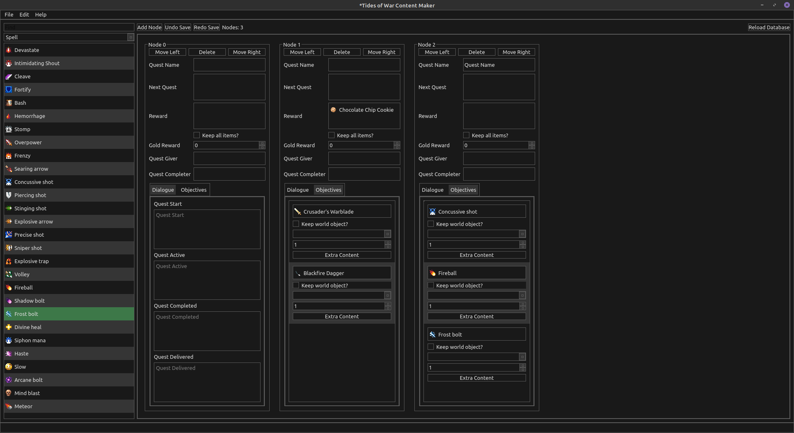
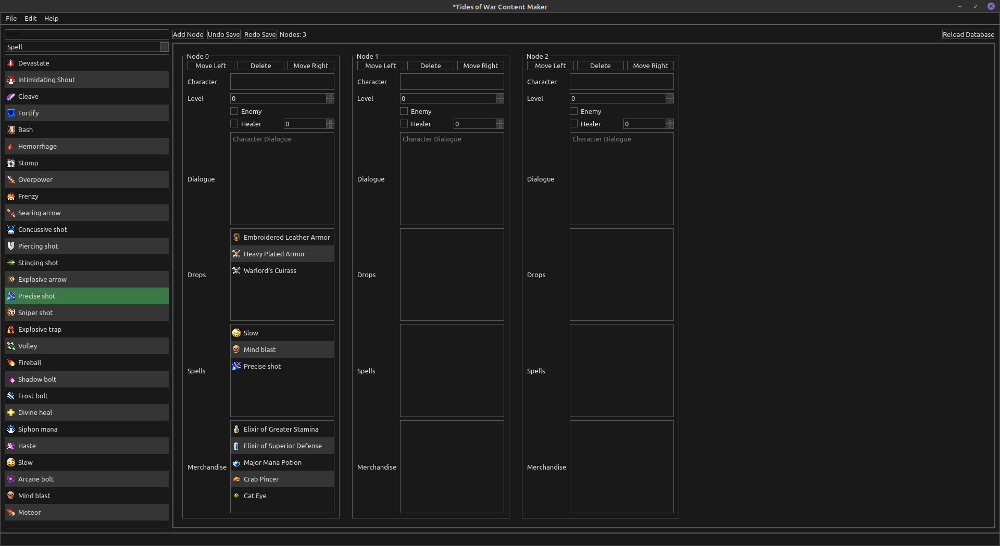

# ToW-tools

## Author:
Ruben Alvarez Reyes

Email: rubenar1996@gmail.com

Twitter: [thisisnotruben_](https://twitter.com/thisisnotruben_)

Instagram: [thisisnotruben](https://www.instagram.com/thisisnotruben/)

Facebook: [Ruben Alvarez Reyes](https://www.facebook.com/thisisnotruben)

## Description:
* Program to help with the workflow of map making in tiled and exports tiled files to game engine.
* Export game databases for game engine.
* All program commands and features can be found in [main.py](core/main.py) *Commands* enum.

## Program used for:
* [Tides of War](https://github.com/thisisnotruben/Tides-of-War)
* [Tiled Map Editor](https://www.mapeditor.org/)
* [Godot Game Engine](https://godotengine.org/)

## Dependencies
* [Tides of War GIMP plug-ins](https://github.com/thisisnotruben/ToW-GIMP-plugin-ins)

## Screenshots

### Core

### Content maker for quests

### Content maker for interactions and drops

